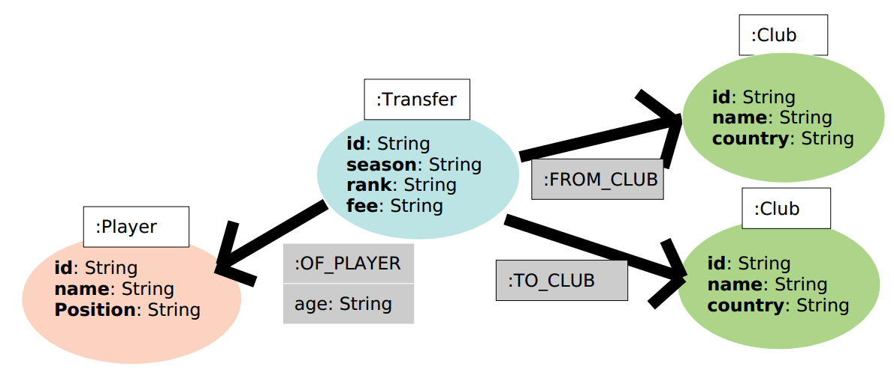

# Transfer Market Analysis of football players

## Nitin Nandeshwar

## 4th April 2020

## Introduction :

The website Transfermarkt provides information about the transfers of professional football players (https://www.transfermarkt.co.uk/). Here, we are going to use Cypher to create some queries on a dataset from Transfermarkt (the dataset is first imported into Neo4j as a graph database).

## Dataset and Neo4j Graph Database.
The Transfermarkt dataset can be found at the file transfers.csv. Each line of the file represents 1 transfer of a football player. We first need to import the CSV file into Neo4j, and generate an associated Graph Database via the commands
presented in the file import.cypher.

Our graph database stores the information via the following nodes and relationships:
*  **Node Player:** Represents the concept of a football player.
    * Labels: Player
    * Properties: id, name, position
*  **Node Club:** Represents the concept of a football club.
    * Labels: Club
    * Properties: id, name, country
* **Node Transfer:** Represents the concept of a football transfer.
    * Labels: Transfer
    * Properties: id, season, rank, fee
* A relationship from a node with label Transfer to a node with label Player represents the fact that the player is involved in the transfer.
    * Relationship Type: OF_PLAYER
    * Properties: age (of the football player when the transfer was done)
* A relationship from a node with label Transfer to a node with label Club represents the fact that the club in involved in the transfer.
    * Relationship Type: FROM_CLUB (representing the club selling the player)
    Properties:
    * Relationship Type: TO_CLUB (representing the club buying the player)
    
The following Figure presents a visualisation of the aforementioned nodes and relationships.

## Task
The file queries.cypher with following 8 Cpyher queries:
1. Return the 'position' of the Node with label 'Player' and 'name' 'Pierre van Hooijdonk'.
2. Return the 'season' and 'fee' for all Nodes with label 'Transfer' and having a
relationship with the Node with label 'Player' and 'name' 'Pierre van Hooijdonk'.
3. Return the maximum ('max') amount of transfers a Node with label 'Player' is
involved in the dataset.
Note: You might consider counting the number of transfers ('count') each Node with
label 'Player' is involved at in order to find the maximum among these numbers.
4. Return the 'name' of all Nodes with label 'Player' involved in 7 transfers (which we
know from the previous is the max number of transfers). Collect the results into a list,
thus returning just 1 row.
5. Return the player 'name' and transfer 'fee' of the most expensive transfer of season
01/02.
6. Return the 'name' of all players transfered to the club 'PSV Eindhoven' in the season
02/03.
7. Return the number of players transferred from a Spanish to an English club.
8. Return the name of the youngest player transferred from 'Real Madrid' to an English
club.
