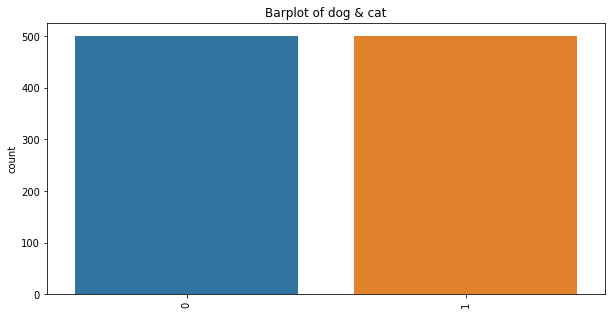
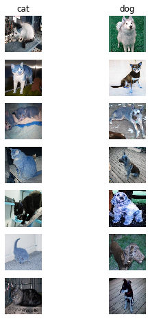
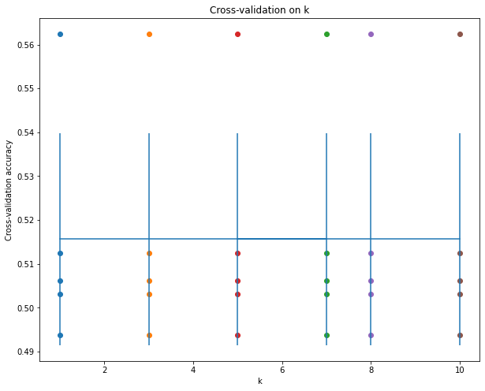
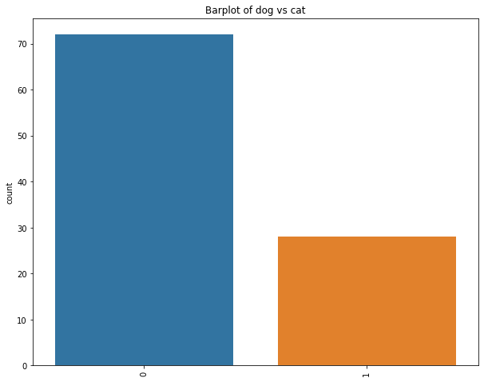

# Cat Vs Dog Image Classifier

## Mr Nitin Nandeshwar
### 21 May 2020

## Introduction:

The objective of this project is to build a machine learning Cat/Dog image classifier.Here we will implement a system to classify whether images contain either a dog or a cat.

## Part A: Pre-processing Phase
### Loading:
For loading the data I have used library os and load the data in variable. Once the data is loaded data is sorted and prepared based on image names.Train data consist of 1000 images of both dog and cat.

Below is the barplot of dog & cat in train data

### Displaying:
Using the imshow function we can visualize the .img train dataset file. Below is the 7 images of dog and cat in train dataset.

#### Resizing:
For resizing the image I have used library cv2 and method used is cv2.INTER_CUBIC
### Part B: Training phase
For Training phase, I have used 2 Models i.e SVM(Support Vector Machine) and K Nearest Neighbor
#### SVM:
Using SVM we got an accuracy of 54 % using 5 fold cross-validation.
#### K Nearest Neighbor:
Using k nearest neighbour we got an accuracy of 55.72% for a testing dataset using the 5 fold crossvalidation.
Based on the accuracy the K Nearest is the best model as it gives the highest accuracy.

### Part C: Optimization phase
For finding the best value of k of K Nearest Neighbor model I have used cross-validation method and below is the accuracy plot for different values of k for 5-fold cross-validation.

Using the best value obtained from the cross-validation is k=1.

#### Test Evaluation:
Below is the predicted barplot for test data using K nearest Neighbor having K=1.

* Test Data contains 50 dogs & 50 cats images.
* From the above barplot of predicted data, we can see we are getting slightly above 50% accuracy on the Test Data using K Nearest Neighbor model using K value as 1.