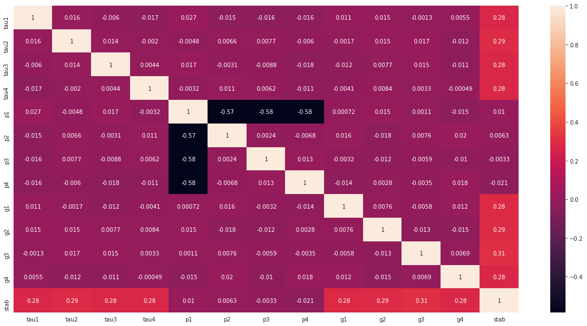

# Electric Grid Stability prediction

## Mr Nitin Nandeshwar
### 26 April 2020

## Abstract
Renewables will soon dominate energy production in our electric power system. And yet, how to integrate renewable energy into the grid and the market is still a subject of major debate. Decentral Smart Grid Control (DSGC) was recently proposed as a robust and decentralized approach to balance supply and demand and to guarantee a grid operation that is both economically and dynamically feasible. Here, we analyze the impact of network topology by assessing the stability of essential network motifs using both linear stability analysis. We would be utilizing various machine learning algorithms like logistic Regression, Decision tree, Support Vector Machines to develop our predictive machine learning model. We would be leveraging the Electric grid stability dataset from the UCI machine learning repository and performing the comparative analysis of various machine learning algorithms. Main focus is to handle the imbalance in our dataset which tends to weaken the model; through various sampling techniques. Moreover the top-performing machine learning models will undergo hyper-parameter optimization to further escalate the model detection performance. Finally a real-time system could be deployed in power sector as a handy tool for the operator to prevent the situation of the Electric grid unstability and will also save the time and maintenance costs of electric grid.
## Introduction
To be reliable, electrical grids need a balance between providing electricity and demand. Thanks to demand-driven electricity output, traditional systems achieve this balance. For future grids with a high share of inflexible (i.e., renewable) energy sources however, the concept of demand response is a promising solution. This implies changes in electricity consumption in reaction to electricity price changes. There are different ways to define the price and communicate it to consumers. Conventional approaches, like local electricity auctions, might cause cybersecurity and privacy issues [1]. The Decentral Smart Grid Control (DSGC) system, proposed recently [2], has received much attention. It avoids much of communication as it ties the electricity price to the grid frequency so that it is available to all participants, i.e., all electricity consumers and producers. By that DSGC introduces a real-time pricing, as opposed to e.g., auctions, where electricity is traded at 15-minutes intervals. 
Current models of DSGC come together with assumptions. Some assumptions facilitate simulations of its stability in [2], i.e., to infer whether the behaviour of participants in response to price changes destabilizes the grid. With the advent of AI and Machine learning along with its increasing use-cases in electric production, one can able to predict whether the electric grid is going to have the stability or not. 
The research objective of this work is to develop an accurate machine learning system that will predict the status of electric grid to be stable or not. To carry out this research project we would be following the end to end machine learning pipeline. The scope of the work lies in comparing various machine learning algorithms for the prediction of the electric grid stability. We also aim to tackle the problem of imbalance in the dataset and selecting the appropriate set of features (feature selection) followed by hyper-parameter optimization to obtain the best performing machine learning model.
Imbalance in the electric grid dataset is the main challenge that tends to reduce the performance of the machine learning model. We will handle this issue with the help of various under-sampling and over-sampling techniques such as Tomek Links and SMOTE (Synthetic Minority Oversampling Technique). Next challenge associated with this work is the about selecting those features which are most relevant to the target feature which we will handle using various Univariate, Tree-based and Greedy-based feature selection mechanisms. For the hyper-parameter optimization, we would be exploring the techniques such as Random-Search CV to improve the model performance. This project aims to tackle with all these challenges in order to come up with an accurate system for predicting the electric grid stability.
The dataset we would be utilizing is the "Electrical Grid Stability Simulated Dataset", created by Vadim Arzamasov (Karlsruher Institut für Technologie, Karlsruhe, Germany) and donated to the University of California (UCI) Machine Learning Repository [3]. For our prediction task we would be employing various machine learning algorithms like Logistic Regression, Decision tree, Support Vector Machines etc for predicition of “stabf” variable to determine the stability of electric grid.

## Methodology

We would be following an exhaustive machine learning lifecycle to carry out the Electric grid stability prediction. This entire machine learning pipeline would be broken down into the individual steps. We would be looking at each of these steps in much more detail in this section. Below is the schematic representation of the process flow which we will follow in this research project.

Fig:  Electric Grid stability process flow

### Electric Grid stability Prediction Lifecycle
We would be following an exhaustive machine learning lifecycle to carry out the Electric grid stability prediction. This entire machine learning pipeline would be broken down into the individual steps. We would be looking at each of these steps in much more detail in this section. Below is the schematic representation of the process flow which we will follow in this research project.
Steps followed in the process flow are as below: 
1) Electric Grid Dataset: We obtained the raw dataset from the UCI machine learning repository which needs to be prepared. The dataset contains 10000 rows with 12 feature variables.
    #### Predictive features:   
    'tau1' to 'tau4': the reaction time of each network participant, a real value within the range 0.5 to 10 ('tau1' corresponds to the supplier node, 'tau2' to 'tau4' to the consumer nodes);  
    'p1' to 'p4': nominal power produced (positive) or consumed (negative) by each network participant, a real value within the range -2.0 to -0.5 for consumers ('p2' to 'p4'). As the total power consumed equals the total power generated, p1 (supplier node) = - (p2 + p3 + p4);  
    'g1' to 'g4': price elasticity coefficient for each network participant, a real value within the range 0.05 to 1.00 ('g1' corresponds to the supplier node, 'g2' to 'g4' to the consumer nodes; 'g' stands for 'gamma');
    #### Dependent variables:   
    'stab': the maximum real part of the characteristic differential equation root (if positive, the system is linearly unstable; if negative, linearly stable);  
    'stabf': a categorical (binary) label ('stable' or 'unstable').

2) Exploratory Data Analysis: This step will help us summarize the main characteristics of our Electric Grid Dataset with the help of visual methods. EDA is for seeing what data can tell us beyond formal modelling or hypothesis testing task. We will understand the feature data in terms of missing values, outliers and the data-types. We will look into some visual plots like box-plots, scatter-plots and correlation matrix that will help us to make more sense out of the data. 

Following is the heatmap numeric columns of Electric grid dataset:

So we can see that there is some relationship between “stab” ,” 'tau1' to 'tau4'”and” 'g1' to 'g4'”.variables 'p1' to 'p4' have high collinearity between them but they have very low correlation with “stab”. So the variable 'p1' to 'p4' will not effect the prediction of classification variable “stabf”.

3) Data Pre-processing: This is the most essential step in machine learning which prepares our data so that it can be a valid input for most of the machine learning and optimization algorithms. Dealing with missing values and the outliers along with feature encoding are the main sub-phases that would be undertaken in this step. We would also be doing feature scaling so that the range of all the features in the dataset is same. Here we will divide the whole dataset into train and test split. The most important steps in this pre-processing phase is to handle the imbalance (only on the training set)  and to select the most appropriate features through the feature selection mechanisms that would be discussed in detail in later chapter. 
As we have seen in python code that dataset contain no missing value and duplication. This dataset is imbalanced with the class (“stabf”) distribution of the 63.8 % (No Stability) and 36.2% (Stability) which tends to reduce the performance of the ML models. We will handle this issue with the help of various under-sampling and over-sampling techniques such as Tomek Links and SMOTE (Synthetic Minority Oversampling Technique).

4) Model Building: Here we would be employing the best performing machine learning algorithms obtained from the background research such as Logistic Regression, Decision tree and SVM . These techniques combine the results from the number of learning algorithms to obtain a better predictive performance than any single machine learning algorithm. We would be training these models on the standard parameters on the training set using the 10-fold cross validation. 
5) Model Evaluation: Most widely used evaluation metrics for the binary classification problem like ours are confusion metrics, f1-score, precision, recall. We would be then choosing the best performing models based on these metrics. 
6) Hyper-parameter Optimization: We will then tune the parameters of the best models with the help of the techniques like Randomized Search CV. We will compare each of these techniques based on the performance. 
RandomizedSearchCV implements a randomized search over parameters, where each setting is sampled from a distribution over possible parameter values. This has two main benefits over an exhaustive search: 1)A budget can be chosen independent of the number of parameters and possible values. 2)Adding parameters that do not influence the performance does not decrease efficiency.
7) Model Validation: We will then check the generalization capability of the best tuned models on the unseen producer data and measure the performance based on the above-mentioned evaluation metrics. And then come up with the most accurate machine learning system to predict whether the electric grid is stable or unstable. 
## Evaluation
Based on the methodology in our research problem, we would be employing the below evaluation metrics to compare the above 3 machine learning models. We would be implementing these metrics by importing the corresponding functions from the sklearn.metrics module of python. We would then be choosing the best model based on these metrics for the tuning of their parameters.
Accuracy: It is the measure of the total number of test instances that are predicted correctly by our model. It does not give us insight about the accuracy for the individual classes present in the target feature. When dealing with the imbalance dataset, the model could overall give a high accuracy but the accuracy of the minority class could be very low as compared with the accuracy of the majority class. In our case the test set is imbalanced so we can’t rely on the accuracy and need to look at the other metrics for evaluation. 
Confusion Matrix: It is the representation of the information about the actual and predicted classifications by the classification algorithm. It gives them insight into the accuracy of each of the classes that are present in the target feature meaning that we get the number of test instances for each class that are correctly as well incorrectly predicted by our model. This makes it a good metrics for the evaluation. 
So by tuning the hyperparameter of different models, we got the following accuracy and hyperparameter values.
### Logistic Regression:
L1 and L2 are regularization parameters. They’re used to avoid overfitting. Both L1 and L2 regularization prevents overfitting by shrinking (imposing a penalty) on the coefficients. L1 is the first moment norm |x1-x2| (|w| for regularization case) that is simply the absolute distance between two points where L2 is second moment norm corresponding to Euclidian Distance that is |x1-x2|^2 (|w|^2 for regularization case).
So by setting the parameter C:60 and Penality as both L1 andL2 we get  an accuracy of 98.75 %
### Decision Tree:
Criterion: Decision trees use multiple algorithms to decide to split a node in two or more sub-nodes.Decision tree splits the nodes on all available variables and then selects the split which results in most homogeneous sub-nodes. The details of Gini and entropy needs detail explanation. 
max_depth(Maximum depth of tree (vertical depth)): Used to control over-fitting as higher depth will allow model to learn relations very specific to a particular sample.
So by setting the parameter max depth to 2 we get an accuracy of 99.98%.
### Support Vector Machine:
The C parameter trades off misclassification of training examples against simplicity of the decision surface. A low C makes the decision surface smooth, while a high C aims at classifying all training examples correctly by giving the model freedom to select more samples as support vectors.
So by setting the parameter C to 3 we get maximum accuracy of 98.42%.
Below is the best confusion matrix of the best model (Decision tree) for predicting the electric grid stability based on the hyperparameter found using randomsearchCV method.

Fig: Confusion matrix plot of Decision tree

To demonstrate the efficiency of the predicting the electric grid stability, here we compares the performance of the Machine learning algorithm (Logistic Regression, Decision tree and Support vector Machine) results in term of Accuracy, precision, recall and F1 score.

## Conclusion:
Based on the results of accuracy, precision, recall and f1 score of different machine learning algorithm, Decision tree is found to best for predicting the stability of electric grid according to the data provided by UCI learning repository.
The accuracy can be further increase by using deep learning neural network algorithm by including other behaviour factors variables of consumers.

## References
[1]	J. Liu, Y. Xiao, S. Li, W. Liang, and C. L. P. Chen, “Cyber security and privacy issues in smart grids,” Commun. Surv. Tutor., vol. 14, no. 4, p. 2012, 2012.
[2]	B. Schäfer, M. Matthiae, M. Timme, and D. Witthaut, “Decentral Smart Grid Control,” New J. Phys., vol. 17, no. 1, p. 015002, Jan. 2015, doi: 10.1088/1367-2630/17/1/015002.
[3]	“UCI Machine Learning Repository: Electrical Grid Stability Simulated Data Data Set.” https://archive.ics.uci.edu/ml/datasets/Electrical+Grid+Stability+Simulated+Data+ (accessed May 17, 2020).
[4]	B. Schäfer, C. Grabow, S. Auer, J. Kurths, D. Witthaut, and M. Timme, “Taming instabilities in power grid networks by decentralized control,” Eur. Phys. J. Spec. Top., vol. 225, no. 3, pp. 569–582, May 2016, doi: 10.1140/epjst/e2015-50136-y.
[5]	V. Arzamasov, K. Böhm, and P. Jochem, “Towards Concise Models of Grid Stability,” in 2018 IEEE International Conference on Communications, Control, and Computing Technologies for Smart Grids (SmartGridComm), Oct. 2018, pp. 1–6, doi: 10.1109/SmartGridComm.2018.8587498.

