# Email Classification

## Mr Nitin Nandeshwar
### 15 January 2020

## Introduction

 In this project, we are going to classify emails as spam or non-spam from the training data using supervised classification techniques. The original dataset contains 5172 rows.

## Preprocessing :

By setting the step size as 0.30 in train_test_split, I split the data into train data and test data I have plotted the bar plot and pie chart of the number of Spam and non-spam for both data set.
### Train Set :

### Test set:

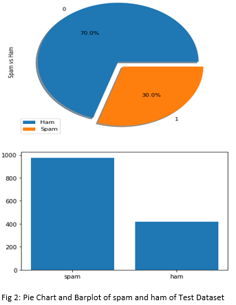

#### Explanation :

As we can see both training data and test data consist of nearly the same 7:3  spam and non-spam target values So we can say that both the train data and test data distribution of Spam and non-spam are similar and balanced.

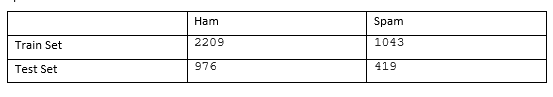

Data Cleaning:
The raw dataset contains the following non-useful text:
* special characters
* single characters 
* multiple spaces
* char 'b' at the beginning
* digits

The above non-useful data are removed using function re.sub from a library re.After removing the duplicate rows from the dataset we get 4647 rows and they exist zero missings (NAN, NaN,na) in the dataset.

### Feature extraction:
Generally, emails contain a lot of non-useful characters like punctuation marks, stop words, digits, etc which may not help to predict the email as spam or ham.
Removal of stop words – Stop words like “was”,” an”,” and”, “the”, “of”, etc are very common in all English sentences and are not very meaningful in deciding spam or legitimate status, so these words have been removed from the emails.
Stemming is the process of reducing inflection in words to their root forms such as mapping a group of words to the same stem even if the stem itself is not a valid word in the Language. For example, playing, plays, played has root word as play so using snowball Stemmer  I have normalized those words to their root word.
After computing the  weight to each word which signifies the importance of the word in the email using sklearn.feature_extraction.text package  TF-IDF vectorization (Term Frequency — Inverse Document Frequency) using the sklearn.feature_extraction.text package, I got the 37964 useful features 
Exploratory data analysis:
After preprocessing the dataset into a matrix of tokens of words by vectorization technique, I have calculated the top 20 most common words in the training dataset for both Spam and Ham.

### Top 20 Ham words:

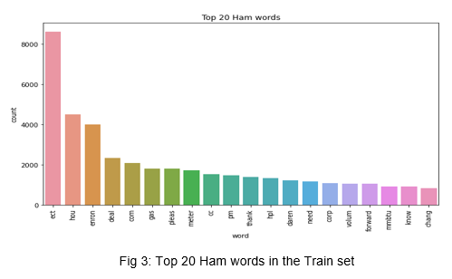

### Top 20 Spam word:

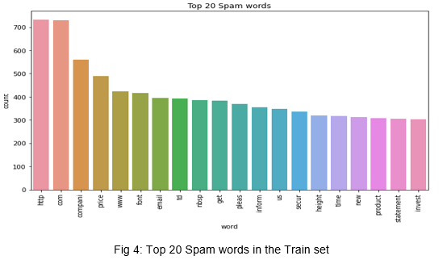

#### Explanation:
As we can see ‘etc’ is the most frequent word in ham emails followed by ‘hou’,’enron’,’deal’ and so on.
Similarly ‘http’ is the most frequent word in spam emails followed by ‘com’,’compani’,’price’ and so on.

### Distributions for Ham and Spam

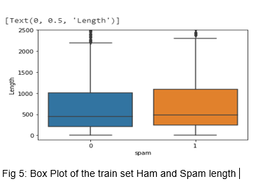

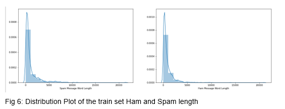

#### Explanation:
As the distribution of length of Spam and Ham email is nearly the same as median for both the boxplot is nearly the same but as there are a lot of outliers in spam compared to ham so spam is more skewed compared to ham. So we can say in the general length of  Spam email is longer compared to the length of the ham email.

### Supervised classification:
Here I have used  K Nearest Neighbor,Decision tree,Logistic Regression and Multinominal Naïve Bayes method to train the model on training dataset using 10 -fold validation technique.

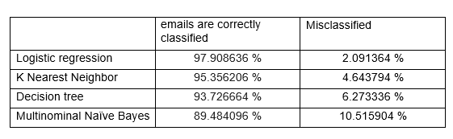

Using sklearn.metrics package we calculated the different score for all above model.
After comparing the above algorithm in term of accuracy, I got the following plot

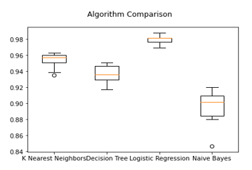

Here we can see the accuracy of correct classification of spam mail is higher for Logistic regression followed by K Nearest Neighbor, Decision tree and lowest for Multinominal Naïve Bayes.
Hyperparameter Setting:

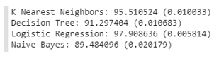

#### Explanation:

*   K-Neighbors Classifier: For Higher value of n_neighbour i.e n>4,we get good accuracy for manhattan_distance (p=1).Even for small value of n_neighbour i.e n =2 to 4 we get good accuracy for euliddean_distance (p=2).

* DecisionTree Classifier: For both gain as gini or entropy there is not much change in accuracy by varying the max_depth.As we increase the max_ depth above 12 the model become an over-fitting model.

* LogisticRegression Classifier: For Ridge Regression (penality=l2),C=0.5 to 1,solver='lbfgs' we get best accuracy maximum accuracy=97.90% .For Lasso Regression (penality=l1),solver='liblinear' we get good accuracy for higher value to C i.e C=10 maximum accuracy=96.92%.

### Model Selection:
Validating the model based upon the hyperparameter setting using the Training data we get the following result for different classifier

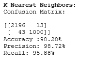

> Misclassified email: 56 out of 3252 

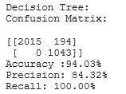

> Misclassified email: 194 out of 3252  and no type 2 error.

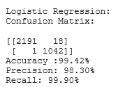

> Misclassified email: 19 out of 3252  and Type 1 error is 18 while Type 2 error is 1.

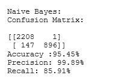

> Misclassified email: 148 out of 3252  and Type 1 error is 1 while Type 2 error is 147.

#### Explanation:
* Based on Accuracy: Logistic Regression is the best model having an accuracy of 99.42% followed by K Nearest Neighbour.
* Based on Precision: Multinominal Navive Bayes is the best model having a precision of 99.89% followed by K Nearest Neighbour.
* Based on Recall : Decision Tree is the best model having Recall of 100% followed by Logistic Regression.

## Model Evaluation:
Setting penalty as Ridge Regression (penalty =l2) with C parameter as 0.5 in Logistic Regression and evaluating the model on the Test set we get the following results.

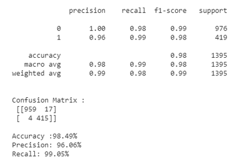

#### Explanation:
* We get an accuracy of 98.49% by correctly identifying the email as spam or ham i.e (959+415)/1395.
* Precision is 96.06 % i.e 415/(415+17) and 
* Recall is 99.05% i.e 415/(415+4) 
* We have only 1.5 % of Misclassified email as spam i.e (17+4)/1395

## ROC Curve

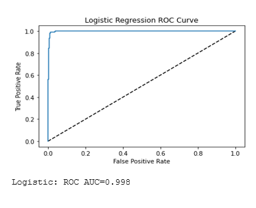

#### Explanation:
As we got ROC_AUC score near to 1 so our logistic regression shows good accuracy in predicting the probability of email as spam or ham

