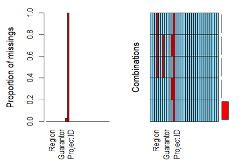
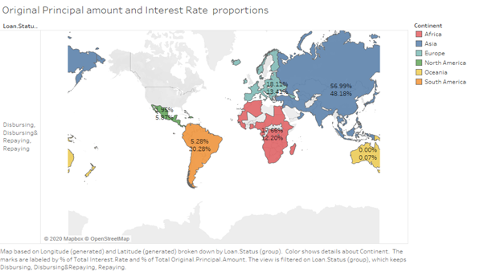
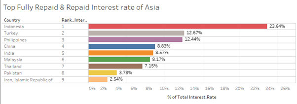
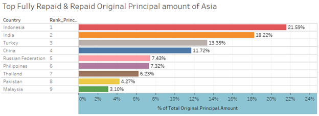
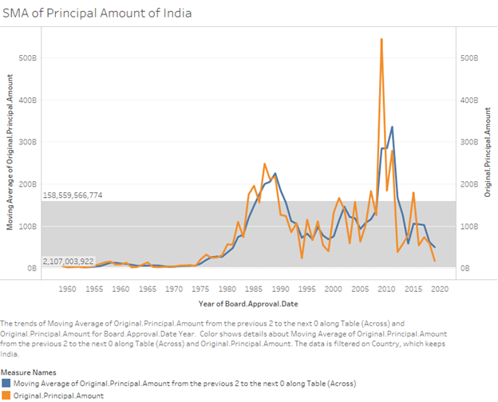
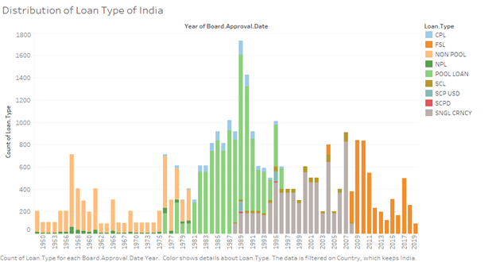

# IBRD Data Visualization

## Mr Nitin Nandeshwar
### 26 March 2020

## Introduction:
Here, I am doing data visualization for IBRD Statement of Loans and IDA Statement of Credits and Grants obtained from Kaggle[1] and Tableau community[2] for the Continent matching.In all, there is 854942 rows and 33 columns.
## Column Definition:
* Country: Country to which a loan has been issued. Loans to the IFC are included under the country “World”
* Loan Type: A type of loan/loan instrument for which distinctive accounting and/or other actions need to be performed. 
  Loan Type Descriptions: 
  * B Loan –Co-financing lending product that includes Contingency and Regular loans and guarantees Pool loan- Currency Pooled Loans 
  * FSL - Fixed Spread Loans (includes both fixed spread loans and IBRD flexible loans that have either fixed spread or variable spread terms) 
  * IFC loan – single currency loans to the IFC 
  * Non-Pool - Original IBRD lending product, before currency pooled loans. 
  * Sngl crncy - - Single Currency Loans 
  * SCP USD - Single Currency Pooled Loans - USD 
  * SCP - DEM - Single Currency Pooled Loans - EUR 
  * SCP JPY - Single Currency Pooled Loans – JPY
* Loan Status: Status of the loan. 
 Loan Status descriptions: 
  * APPROVED - Loan has been approved by the Bank 
  * SIGNED - Loan has been signed by both parties 
  * EFFECTIVE - Loan has been made effective following the terms of the legal agreement 
  * DISBURSING - Loan is disbursing 
  * DISBURSED - Loan has no undisbursed balance 
  * REPAID - Loan has been fully repaid 
  * CANCELLED - Entire loan principal has been 
  * cancelled TERMINATED - Unsigned loan that has been cancelled in full
* Interest Rate: Current Interest rate or service charge applied to the loan. For loans that could have more than one interest rate (e.g. FSL or SCL fixed-rate loans), the interest rate is shown as “0”.
* Disbursed Amount: The amount that has been disbursed from a loan commitment in equivalent US dollars, calculated at the exchange rate on the value date of the individual disbursements.
* Board Approval Date: The date the World Bank approves the loan.
* Original Principal Amount: The original US dollar amount of the loan that is committed and approved.

## Missing value Visualization :

```R program
  # Loading the comma-separated file
A=read.csv("ibrd-statement-of-loans-historical-data.csv")
a <- aggr(A)
```


```R program
col_sumofNA <- function(n){ 
  for (i in 1:ncol(n)) {
    if(sum(is.na(n[i]))>0) # checking NA values using is.na() function
      cat(colnames(n[i])," contains ",sum(is.na(n[i])),"  NA values \n")
    # print the NA Values containing column in the dataset
  }
}  
col_sumofNA(A)

## Country.Code  contains  204   NA values 
## Guarantor.Country.Code  contains  202   NA values 
## Interest.Rate  contains  27028   NA values 
## Currency.of.Commitment  contains  854942   NA values
```
## Explanation:
* As we can see there are lots of missing value particularly in the currency of commitment it contains no data so we can remove that column directly.
### After preprocessing the Dataset:


## Explanation:
* After data cleaning, we were able to reduce the Dataset into 17 columns and 827914 rows
# Tableau Data Visualization :
### Figure 1:


## Explanation:
Here we can see that the distribution is not uniform there are some irregularities between the year 1980 to 1995 and the year 2008 to 2012 it might due to external factors like recession or some other crisis. And this external factor affects more to Africa and Asian Continents and we can see that interest rate proportion is nearly zero to make the economy stable.

### Figure 2:



## Explanation:
As we can see that the original principal amount and interest rate total percentage proportion as per the loan status level which helps us to better visualize the data according to the loan status level. 
From the above plot, we can infer that Asian continent is the highest loan Fully repaid and repaid continent with 33.47 % of total principal amount and also the highest Fully cancelled and cancelled loan with nearly 40% of the total principal amount.Similarly, we can infer other information about different Loan Status level.
### Figure 3:



### Figure 4 :



## Explanation:
As per various type of plot in Tableau[3] and youtube videos[4], the above figure 3 & 4, we can infer that for fully repaid & Repaid loan status the total interest rate and total original principal amount percentage is highest for Indonesia of the Asian continent with 23.64% total interest rate percentage.
From this plot, it can help us to decide how much is the loan paying interest rate and Principal amount credibility of a particular country

### Figure 5:



## Explanation:
From the above figure, we can infer that the original principal amount taken by country India is above the standard deviation range of -1 to 1 in the year 1984 to 1990 and the year 2008 to 2012 . In both, the case India has faced a major crisis in the year 2008 to 2012 because the principal amount taken is more than 3 times the normal value i.e 500billion.
So here we can find seasonal variation and the bank can properly plan its future steps to cope with this kind of crisis.
### Figure 6:


## Explanation:
As we have seen that India have to face some crisis during the year 1984 – 1990 and the year 2008 – 2012. So from the above figure bank can see which type of loan generally is taken during this period.
In the above figure, the maximum number of POOL Loan and CPL loans taken during the period 1984 – 1990. while the maximum number of  FSL type of loan is taken during a major crisis compared to other types of loan.
Similar we can check for all other countries by varying the country in the filter box.
### Figure 7:



## References :
* [1]	“IBRD Statement Of Loans Data.” https://kaggle.com/theworldbank/ibrd-statement-of-loans-data (accessed Mar. 26, 2020).
* [2]	“Group countries in to continents? |Tableau Community Forums.” https://community.tableau.com/thread/179289 (accessed Mar. 26, 2020).
* [3]	“Build Common Chart Types in Data Views - Tableau.” https://help.tableau.com/current/pro/desktop/en-us/dataview_examples.htm (accessed Mar. 26, 2020)
 
* [4]	“(51) Tableau - Introduction - YouTube.” https://www.youtube.com/watch?v=gWZtNdMko1k&list=PLWPirh4EWFpGXTBu8ldLZGJCUeTMBpJFK (accessed Mar. 26, 2020).


